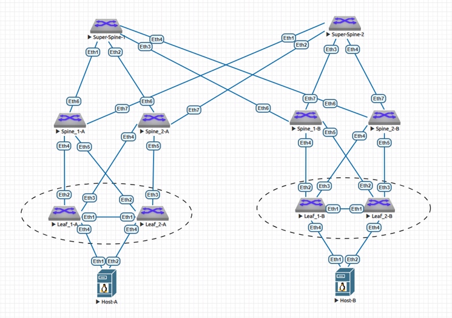
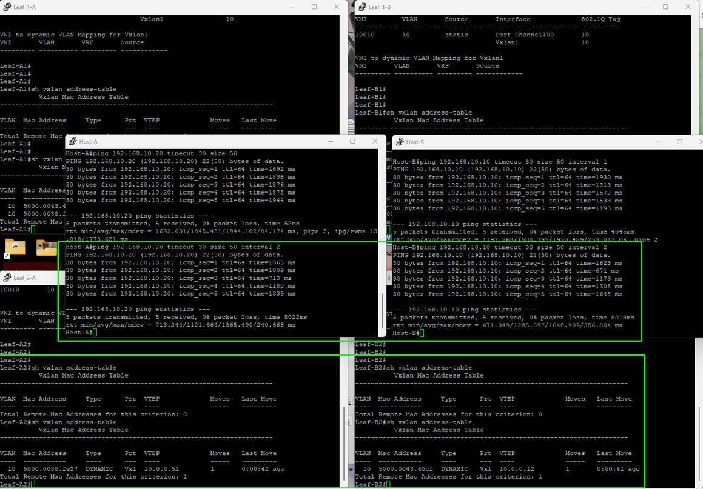

## Работа по защите проекта, курса "Дизайн сетей ЦОД" 2025г. школы "OTUS"

# Тема: "Отказоустойчивый сервис в растянутом L2 на две фабрики"


## Верхнеуровнево: Фабрика EVPN/VXLAN

1. Архитектура и основные технологии:
    - 2 POD'а (POD-A, POD-B) (clos)
    - Super-Spine
    - IS-IS underlay
    - BGP EVPN overlay
    - MLAG
    - PortChannel
    - Anycast Gateway
 
2. Статус архитектуры:
    - Рабочая и протестированная конфигурация в EVE-NG на образах "Arista vEOS 4.29.2F"

---

## 0. Коммутация и распределение линков



---

## 1. Таблица адресного пространства

### Определимся с подсетями

| Префикс | Назначение |
|--------|-----------|
| 10.0.0.0/24 | Loopback'и, MLAG Peer-Link |
| 172.16.0.0/16 | POD-A Underlay (Leaf → Spine) |
| 172.18.0.0/16 | POD-B Underlay (Leaf → Spine) |
| 172.17.0.0/24 | Super-Spine линки (Spine → Super-Spine) |
| 192.168.10.0/24 | Клиентская сеть (VLAN 10) |

---

### Loopback'и

| Устройство | Loopback0 | Назначение |
|-----------|-----------|-----------|
| Leaf-A1 | 10.0.0.11/32 | BGP RID, VTEP |
| Leaf-A2 | 10.0.0.12/32 | BGP RID, VTEP |
| Leaf-B1 | 10.0.0.51/32 | BGP RID, VTEP |
| Leaf-B2 | 10.0.0.52/32 | BGP RID, VTEP |
| Spine-A1 | 10.0.0.21/32 | BGP RID, IS-IS |
| Spine-A2 | 10.0.0.22/32 | BGP RID, IS-IS |
| Spine-B1 | 10.0.0.41/32 | BGP RID, IS-IS |
| Spine-B2 | 10.0.0.42/32 | BGP RID, IS-IS |
| Super-Spine-1 | 10.0.0.31/32 | BGP RID, IS-IS |
| Super-Spine-2 | 10.0.0.32/32 | BGP RID, IS-IS |

---

### P2P Underlay (Leaf → Spine)

| Устройство | Интерфейс | IP | Назначение |
|-----------|----------|-----|-----------|
| Leaf-A1 → Spine-A1 | Et2 ↔️ Et4 | 172.16.1.1/31 ↔️ 172.16.1.0/31 | IS-IS L2 |
| Leaf-A2 → Spine-A1 | Et2 ↔️ Et5 | 172.16.1.3/31 ↔️ 172.16.1.2/31 | IS-IS L2 |
| Leaf-A1 → Spine-A2 | Et3 ↔️ Et4 | 172.16.2.1/31 ↔️ 172.16.2.0/31 | IS-IS L2 |
| Leaf-A2 → Spine-A2 | Et3 ↔️ Et5 | 172.16.2.3/31 ↔️ 172.16.2.2/31 | IS-IS L2 |
| Leaf-B1 → Spine-B1 | Et2 ↔️ Et4 | 172.18.1.1/31 ↔️ 172.18.1.0/31 | IS-IS L2 |
| Leaf-B2 → Spine-B1 | Et2 ↔️ Et5 | 172.18.2.1/31 ↔️ 172.18.2.0/31 | IS-IS L2 |
| Leaf-B1 → Spine-B2 | Et3 ↔️ Et4 | 172.18.3.1/31 ↔️ 172.18.3.0/31 | IS-IS L2 |
| Leaf-B2 → Spine-B2 | Et3 ↔️ Et5 | 172.18.4.1/31 ↔️ 172.18.4.0/31 | IS-IS L2 |

---

### P2P Underlay (Spine → Super-Spine)

| Устройство | Интерфейс | IP | Назначение |
|-----------|----------|-----|-----------|
| Spine-A1 → Super-Spine-1 | Et6 ↔️ Et1 | 172.17.1.1/31 ↔️ 172.17.1.0/31 | IS-IS L2 |
| Spine-A2 → Super-Spine-1 | Et6 ↔️ Et2 | 172.17.2.1/31 ↔️ 172.17.2.0/31 | IS-IS L2 |
| Spine-B1 → Super-Spine-1 | Et6 ↔️ Et3 | 172.17.3.1/31 ↔️ 172.17.3.0/31 | IS-IS L2 |
| Spine-B2 → Super-Spine-1 | Et6 ↔️ Et4 | 172.17.4.1/31 ↔️ 172.17.4.0/31 | IS-IS L2 |
| Spine-A1 → Super-Spine-2 | Et7 ↔️ Et1 | 172.17.5.1/31 ↔️ 172.17.5.0/31 | IS-IS L2 |
| Spine-A2 → Super-Spine-2 | Et7 ↔️ Et2 | 172.17.6.1/31 ↔️ 172.17.6.0/31 | IS-IS L2 |
| Spine-B1 → Super-Spine-2 | Et7 ↔️ Et3 | 172.17.7.1/31 ↔️ 172.17.7.0/31 | IS-IS L2 |
| Spine-B2 → Super-Spine-2 | Et7 ↔️ Et4 | 172.17.8.1/31 ↔️ 172.17.8.0/31 | IS-IS L2 |

---

### MLAG Peer-Link (L3)

| Устройство | Интерфейс | IP | Назначение |
|-----------|----------|-----|-----------|
| Leaf-A1 ↔️ Leaf-A2 | Vlan4094 | 10.0.0.1/30 ↔️ 10.0.0.2/30 | MLAG Peer-Link |
| Leaf-B1 ↔️ Leaf-B2 | Vlan4094 | 10.0.0.5/30 ↔️ 10.0.0.6/30 | MLAG Peer-Link |

---

### Overlay (L2 VNI)

| VLAN | VNI | Назначение |
|------|-----|-----------|
| 10 | 10010 | Клиентская сеть (растянута между POD'ами) |

---

### Клиентская сеть (k8s)

| Назначение | IP | Устройство |
|-----------|-----|-----------|
| Anycast Gateway | 192.168.10.254/24 | На всех Leaf в Vlan10 |
| Host-A | 192.168.10.10/24 | Host-A |
| Host-B | 192.168.10.20/24 | Host-B |

---
---

## 2. Список узлов (вывод "sh run" каждого)

---

### Host-A
```
Host-A#sh run
! Command: show running-config
! device: Host-A (vEOS-lab, EOS-4.29.2F)
!
! boot system flash:/vEOS-lab.swi
!
no aaa root
!
transceiver qsfp default-mode 4x10G
!
service routing protocols model ribd
!
hostname Host-A
!
spanning-tree mode mstp
!
vlan 10
!
interface Port-Channel100
   description Uplink to MLAG
   switchport trunk allowed vlan 10
   switchport mode trunk
!
interface Ethernet1
   description To-Leaf-A1
   channel-group 100 mode active
!
interface Ethernet2
   description To-Leaf-A2
   channel-group 100 mode active
!
interface Ethernet3
!
interface Ethernet4
!
interface Ethernet5
!
interface Ethernet6
!
interface Ethernet7
!
interface Ethernet8
!
interface Management1
!
interface Vlan10
   description Client Interface
   ip address 192.168.10.10/24
!
ip routing
!
ip route 0.0.0.0/0 192.168.10.254
!
end
Host-A#
```

---

### Host-B
```
Host-B#sh run
! Command: show running-config
! device: Host-B (vEOS-lab, EOS-4.29.2F)
!
! boot system flash:/vEOS-lab.swi
!
no aaa root
!
transceiver qsfp default-mode 4x10G
!
service routing protocols model ribd
!
hostname Host-B
!
spanning-tree mode mstp
!
vlan 10
!
interface Port-Channel100
   description Uplink to MLAG (Leaf-B1/B2)
   switchport trunk allowed vlan 10
   switchport mode trunk
!
interface Ethernet1
   description To-Leaf-B1
   channel-group 100 mode active
!
interface Ethernet2
   description To-Leaf-B2
   channel-group 100 mode active
!
interface Ethernet3
!
interface Ethernet4
!
interface Ethernet5
!
interface Ethernet6
!
interface Ethernet7
!
interface Ethernet8
!
interface Management1
!
interface Vlan10
   description Client Interface
   ip address 192.168.10.20/24
!
ip routing
!
ip route 0.0.0.0/0 192.168.10.254
!
end
Host-B#
```

---

### Leaf-A1
```
Leaf-A1#sh run
! Command: show running-config
! device: Leaf-A1 (vEOS-lab, EOS-4.29.2F)
!
! boot system flash:/vEOS-lab.swi
!
no aaa root
!
transceiver qsfp default-mode 4x10G
!
service routing protocols model multi-agent
!
hostname Leaf-A1
!
spanning-tree mode mstp
!
vlan 10
   name CLIENTS
!
vlan 4094
   name mlag-peer
!
interface Port-Channel10
   description MLAG-Peer-Link
   switchport trunk allowed vlan 4094
   switchport mode trunk
!
interface Port-Channel100
   description Host-A Uplink (MLAG)
   switchport trunk allowed vlan 10
   switchport mode trunk
   mlag 100
!
interface Port-Channel101
   switchport mode trunk
   switchport trunk group mlag-peer
!
interface Ethernet1
   description To-Leaf-A2 (MLAG Peer)
   channel-group 101 mode active
!
interface Ethernet2
   description To-Spine-A1
   no switchport
   ip address 172.16.1.1/31
   channel-group 10 mode active
   isis enable 1
   isis metric 50
!
interface Ethernet3
   description To-Spine-A2
   no switchport
   ip address 172.16.2.1/31
   isis enable 1
   isis metric 50
!
interface Ethernet4
   description To-Host-A (Port1)
   channel-group 100 mode active
!
interface Ethernet5
!
interface Ethernet6
!
interface Ethernet7
!
interface Ethernet8
!
interface Loopback0
   ip address 10.0.0.11/32
   isis enable 1
!
interface Management1
!
interface Vlan10
   ip address 192.168.10.1/24
   ip virtual-router address 192.168.10.254
!
interface Vlan4094
   ip address 10.0.0.1/30
!
interface Vxlan1
   vxlan source-interface Loopback0
   vxlan udp-port 4789
   vxlan vlan 10 vni 10010
   vxlan flood vtep 10.0.0.12 10.0.0.51 10.0.0.52
!
ip virtual-router mac-address 00:00:11:11:22:22
!
ip routing
!
ip prefix-list FROM-IS-IS seq 10 permit 10.0.0.0/24 le 32
!
mlag configuration
   domain-id POD-A
   local-interface Vlan4094
   peer-address 10.0.0.2
   peer-link Port-Channel101
!
route-map IS-IS-to-BGP permit 10
   match ip address prefix-list FROM-IS-IS
!
router bgp 65001
   router-id 10.0.0.11
   no bgp default ipv4-unicast
   neighbor LEAF-EVPN peer group
   neighbor LEAF-EVPN remote-as 65001
   neighbor LEAF-EVPN update-source Loopback0
   neighbor LEAF-EVPN ebgp-multihop 5
   neighbor LEAF-EVPN route-reflector-client
   neighbor LEAF-EVPN send-community extended
   neighbor 10.0.0.12 peer group LEAF-EVPN
   neighbor 10.0.0.21 remote-as 65000
   neighbor 10.0.0.21 route-map IS-IS-to-BGP in
   neighbor 10.0.0.22 remote-as 65000
   neighbor 10.0.0.22 route-map IS-IS-to-BGP in
   neighbor 10.0.0.51 peer group LEAF-EVPN
   neighbor 10.0.0.52 peer group LEAF-EVPN
   !
   address-family evpn
      neighbor LEAF-EVPN activate
!
router isis 1
   net 49.0001.0000.0000.0011.00
   is-type level-2
   log-adjacency-changes
   !
   address-family ipv4 unicast
      maximum-paths 4
!
end
Leaf-A1#
```

---

### Leaf-A2
```
Leaf-A2#sh run
! Command: show running-config
! device: Leaf-A2 (vEOS-lab, EOS-4.29.2F)
!
! boot system flash:/vEOS-lab.swi
!
no aaa root
!
transceiver qsfp default-mode 4x10G
!
service routing protocols model multi-agent
!
hostname Leaf-A2
!
spanning-tree mode mstp
!
vlan 10
   name CLIENTS
!
vlan 4094
   name mlag-peer
!
interface Port-Channel10
   description MLAG-Peer-Link
   switchport trunk allowed vlan 4094
   switchport mode trunk
!
interface Port-Channel100
   description Host-A Uplink (MLAG)
   switchport trunk allowed vlan 10
   switchport mode trunk
   mlag 100
!
interface Port-Channel101
   switchport mode trunk
   switchport trunk group mlag-peer
!
interface Ethernet1
   description To-Leaf-A1 (MLAG Peer)
   channel-group 101 mode active
!
interface Ethernet2
   description To-Spine-A1
   no switchport
   ip address 172.16.1.3/31
   channel-group 10 mode active
   isis enable 1
   isis metric 50
!
interface Ethernet3
   description To-Spine-A2
   no switchport
   ip address 172.16.2.3/31
   isis enable 1
   isis metric 50
!
interface Ethernet4
   description To-Host-A (Port2)
   channel-group 100 mode active
!
interface Ethernet5
!
interface Ethernet6
!
interface Ethernet7
!
interface Ethernet8
!
interface Loopback0
   ip address 10.0.0.12/32
   isis enable 1
!
interface Management1
!
interface Vlan10
   ip address 192.168.10.2/24
   ip virtual-router address 192.168.10.254
!
interface Vlan4094
   ip address 10.0.0.2/30
!
interface Vxlan1
   vxlan source-interface Loopback0
   vxlan udp-port 4789
   vxlan vlan 10 vni 10010
   vxlan flood vtep 10.0.0.11 10.0.0.51 10.0.0.52
!
ip virtual-router mac-address 00:00:11:11:22:22
!
ip routing
!
ip prefix-list FROM-IS-IS seq 10 permit 10.0.0.0/24 le 32
!
mlag configuration
   domain-id POD-A
   local-interface Vlan4094
   peer-address 10.0.0.1
   peer-link Port-Channel101
!
route-map IS-IS-to-BGP permit 10
   match ip address prefix-list FROM-IS-IS
!
router bgp 65001
   router-id 10.0.0.12
   no bgp default ipv4-unicast
   neighbor LEAF-EVPN peer group
   neighbor LEAF-EVPN remote-as 65001
   neighbor LEAF-EVPN update-source Loopback0
   neighbor LEAF-EVPN ebgp-multihop 5
   neighbor LEAF-EVPN send-community extended
   neighbor 10.0.0.11 peer group LEAF-EVPN
   neighbor 10.0.0.21 remote-as 65000
   neighbor 10.0.0.22 remote-as 65000
   !
   address-family evpn
      neighbor LEAF-EVPN activate
   !
   address-family ipv4
      neighbor 10.0.0.21 route-map IS-IS-to-BGP in
      neighbor 10.0.0.22 route-map IS-IS-to-BGP in
!
router isis 1
   net 49.0001.0000.0000.0012.00
   is-type level-2
   log-adjacency-changes
   !
   address-family ipv4 unicast
      maximum-paths 4
!
end
Leaf-A2#
```

---

### Leaf-B1
```
Leaf-B1#sh run
! Command: show running-config
! device: Leaf-B1 (vEOS-lab, EOS-4.29.2F)
!
! boot system flash:/vEOS-lab.swi
!
no aaa root
!
transceiver qsfp default-mode 4x10G
!
service routing protocols model multi-agent
!
hostname Leaf-B1
!
spanning-tree mode mstp
!
vlan 10
   name CLIENTS
!
vlan 4094
   name mlag-peer
!
interface Port-Channel10
!
interface Port-Channel100
   description Host-B Uplink (MLAG)
   switchport trunk allowed vlan 10
   switchport mode trunk
   mlag 100
!
interface Port-Channel101
   switchport mode trunk
   switchport trunk group mlag-peer
!
interface Ethernet1
   description To-Leaf-B2 (MLAG Peer)
   channel-group 101 mode active
!
interface Ethernet2
   description To-Spine-B1
   no switchport
   ip address 172.18.1.1/31
   isis enable 1
   isis metric 50
!
interface Ethernet3
   description To-Spine-B2
   no switchport
   ip address 172.18.3.1/31
   isis enable 1
   isis metric 50
!
interface Ethernet4
   description To-Host-B (Port1)
   channel-group 100 mode active
!
interface Ethernet5
!
interface Ethernet6
!
interface Ethernet7
!
interface Ethernet8
!
interface Loopback0
   ip address 10.0.0.51/32
   isis enable 1
!
interface Management1
!
interface Vlan10
   ip address 192.168.10.3/24
   ip virtual-router address 192.168.10.254
!
interface Vlan4094
   ip address 10.0.0.5/30
!
interface Vxlan1
   vxlan source-interface Loopback0
   vxlan udp-port 4789
   vxlan vlan 10 vni 10010
   vxlan flood vtep 10.0.0.11 10.0.0.12 10.0.0.52
!
ip virtual-router mac-address 00:00:11:11:22:22
!
ip routing
!
ip prefix-list FROM-IS-IS seq 10 permit 10.0.0.0/24 le 32
!
mlag configuration
   domain-id POD-B
   local-interface Vlan4094
   peer-address 10.0.0.6
   peer-link Port-Channel101
!
route-map IS-IS-to-BGP permit 10
   match ip address prefix-list FROM-IS-IS
!
router bgp 65001
   router-id 10.0.0.51
   no bgp default ipv4-unicast
   neighbor LEAF-EVPN peer group
   neighbor LEAF-EVPN remote-as 65001
   neighbor LEAF-EVPN update-source Loopback0
   neighbor LEAF-EVPN ebgp-multihop 5
   neighbor LEAF-EVPN send-community extended
   neighbor 10.0.0.11 peer group LEAF-EVPN
   !
   address-family evpn
      neighbor LEAF-EVPN activate
      neighbor 10.0.0.41 route-map IS-IS-to-BGP in
      neighbor 10.0.0.42 route-map IS-IS-to-BGP in
!
router isis 1
   net 49.0001.0000.0000.0051.00
   is-type level-2
   log-adjacency-changes
   !
   address-family ipv4 unicast
      maximum-paths 4
!
end
Leaf-B1#
```

---

### Leaf-B2
```
Leaf-B2#sh run
! Command: show running-config
! device: Leaf-B2 (vEOS-lab, EOS-4.29.2F)
!
! boot system flash:/vEOS-lab.swi
!
no aaa root
!
transceiver qsfp default-mode 4x10G
!
service routing protocols model multi-agent
!
hostname Leaf-B2
!
spanning-tree mode mstp
!
vlan 10
   name CLIENTS
!
vlan 4094
   name mlag-peer
!
interface Port-Channel10
!
interface Port-Channel100
   description Host-B Uplink (MLAG)
   switchport trunk allowed vlan 10
   switchport mode trunk
   mlag 100
!
interface Port-Channel101
   switchport mode trunk
   switchport trunk group mlag-peer
!
interface Ethernet1
   description To-Leaf-B1 (MLAG Peer)
   channel-group 101 mode active
!
interface Ethernet2
   description To-Spine-B1
   no switchport
   ip address 172.18.2.1/31
   isis enable 1
   isis metric 50
!
interface Ethernet3
   description To-Spine-B2
   no switchport
   ip address 172.18.4.1/31
   isis enable 1
   isis metric 50
!
interface Ethernet4
   description To-Host-B (Port2)
   channel-group 100 mode active
!
interface Ethernet5
!
interface Ethernet6
!
interface Ethernet7
!
interface Ethernet8
!
interface Loopback0
   ip address 10.0.0.52/32
   isis enable 1
!
interface Management1
!
interface Vlan10
   ip address 192.168.10.4/24
   ip virtual-router address 192.168.10.254
!
interface Vlan4094
   ip address 10.0.0.6/30
!
interface Vxlan1
   vxlan source-interface Loopback0
   vxlan udp-port 4789
   vxlan vlan 10 vni 10010
   vxlan flood vtep 10.0.0.11 10.0.0.12 10.0.0.51
!
ip virtual-router mac-address 00:00:11:11:22:22
!
ip routing
!
ip prefix-list FROM-IS-IS seq 10 permit 10.0.0.0/24 le 32
!
mlag configuration
   domain-id POD-B
   local-interface Vlan4094
   peer-address 10.0.0.5
   peer-link Port-Channel101
!
route-map IS-IS-to-BGP permit 10
   match ip address prefix-list FROM-IS-IS
!
router bgp 65001
   router-id 10.0.0.52
   no bgp default ipv4-unicast
   neighbor LEAF-EVPN peer group
   neighbor LEAF-EVPN remote-as 65001
   neighbor LEAF-EVPN update-source Loopback0
   neighbor LEAF-EVPN ebgp-multihop 5
   neighbor LEAF-EVPN send-community extended
   neighbor 10.0.0.11 peer group LEAF-EVPN
   !
   address-family evpn
      neighbor LEAF-EVPN activate
      neighbor 10.0.0.41 route-map IS-IS-to-BGP in
      neighbor 10.0.0.42 route-map IS-IS-to-BGP in
!
router isis 1
   net 49.0001.0000.0000.0052.00
   is-type level-2
   log-adjacency-changes
   !
   address-family ipv4 unicast
      maximum-paths 4
!
end
Leaf-B2#
```

---

### Spine-A1
```
Spine-A1#sh run
! Command: show running-config
! device: Spine-A1 (vEOS-lab, EOS-4.29.2F)
!
! boot system flash:/vEOS-lab.swi
!
no aaa root
!
transceiver qsfp default-mode 4x10G
!
service routing protocols model ribd
!
hostname Spine-A1
!
spanning-tree mode mstp
!
interface Ethernet1
!
interface Ethernet2
!
interface Ethernet3
!
interface Ethernet4
   description To-Leaf-A1
   no switchport
   ip address 172.16.1.0/31
   isis enable 1
   isis metric 50
!
interface Ethernet5
   description To-Leaf-A2
   no switchport
   ip address 172.16.1.2/31
   isis enable 1
   isis metric 50
!
interface Ethernet6
   description to-super-spine-1
   no switchport
   ip address 172.17.1.1/31
   isis enable 1
   isis metric 50
!
interface Ethernet7
   description To-Super-Spine-2
   no switchport
   ip address 172.17.5.1/31
   isis enable 1
   isis metric 50
!
interface Ethernet8
!
interface Loopback0
   ip address 10.0.0.21/32
   isis enable 1
!
interface Management1
!
ip routing
!
router isis 1
   net 49.0001.0000.0000.0001.00
   is-type level-2
   log-adjacency-changes
   !
   address-family ipv4 unicast
      maximum-paths 4
!
end
Spine-A1#
```

---

### Spine-A2
```
Spine-A2#sh run
! Command: show running-config
! device: Spine-A2 (vEOS-lab, EOS-4.29.2F)
!
! boot system flash:/vEOS-lab.swi
!
no aaa root
!
transceiver qsfp default-mode 4x10G
!
service routing protocols model ribd
!
hostname Spine-A2
!
spanning-tree mode mstp
!
interface Ethernet1
!
interface Ethernet2
!
interface Ethernet3
!
interface Ethernet4
   description To-Leaf-A1
   no switchport
   ip address 172.16.2.0/31
   isis enable 1
   isis metric 50
!
interface Ethernet5
   description To-Leaf-A2
   no switchport
   ip address 172.16.2.2/31
   isis enable 1
   isis metric 50
!
interface Ethernet6
   description to-s-spine-1
   no switchport
   ip address 172.17.2.1/31
   isis enable 1
   isis metric 50
!
interface Ethernet7
   description To-Super-Spine-2
   no switchport
   ip address 172.17.6.1/31
   isis enable 1
   isis metric 50
!
interface Ethernet8
!
interface Loopback0
   ip address 10.0.0.22/32
   isis enable 1
!
interface Management1
!
ip routing
!
router isis 1
   net 49.0001.0000.0000.0002.00
   is-type level-2
   log-adjacency-changes
   !
   address-family ipv4 unicast
      maximum-paths 4
!
end
Spine-A2#
```

---

### Spine-B1
```
Spine-B1#sh run
! Command: show running-config
! device: Spine-B1 (vEOS-lab, EOS-4.29.2F)
!
! boot system flash:/vEOS-lab.swi
!
no aaa root
!
transceiver qsfp default-mode 4x10G
!
service routing protocols model ribd
!
hostname Spine-B1
!
spanning-tree mode mstp
!
interface Ethernet1
!
interface Ethernet2
!
interface Ethernet3
!
interface Ethernet4
   description To-Leaf-B1
   no switchport
   ip address 172.18.1.0/31
   isis enable 1
   isis metric 50
!
interface Ethernet5
   description To-Leaf-B2
   no switchport
   ip address 172.18.2.0/31
   isis enable 1
   isis metric 50
!
interface Ethernet6
   description To-Super-Spine-1
   no switchport
   ip address 172.17.3.1/31
   isis enable 1
   isis metric 50
!
interface Ethernet7
   description To-Super-Spine-2
   no switchport
   ip address 172.17.7.1/31
   isis enable 1
   isis metric 50
!
interface Ethernet8
!
interface Loopback0
   ip address 10.0.0.41/32
   isis enable 1
!
interface Management1
!
ip routing
!
router isis 1
   net 49.0001.0000.0000.0041.00
   is-type level-2
   log-adjacency-changes
   !
   address-family ipv4 unicast
      maximum-paths 4
!
end
Spine-B1#
```

---

### Spine-B2
```
Spine-B2#sh run
! Command: show running-config
! device: Spine-B2 (vEOS-lab, EOS-4.29.2F)
!
! boot system flash:/vEOS-lab.swi
!
no aaa root
!
transceiver qsfp default-mode 4x10G
!
service routing protocols model ribd
!
hostname Spine-B2
!
spanning-tree mode mstp
!
interface Ethernet1
!
interface Ethernet2
!
interface Ethernet3
!
interface Ethernet4
   description To-Leaf-B1
   no switchport
   ip address 172.18.3.0/31
   isis enable 1
   isis metric 50
!
interface Ethernet5
   description To-Leaf-B2
   no switchport
   ip address 172.18.4.0/31
   isis enable 1
   isis metric 50
!
interface Ethernet6
   description To-Super-Spine-1
   no switchport
   ip address 172.17.4.1/31
   isis enable 1
   isis metric 50
!
interface Ethernet7
   description To-Super-Spine-2
   no switchport
   ip address 172.17.8.1/31
   isis enable 1
   isis metric 50
!
interface Ethernet8
!
interface Loopback0
   ip address 10.0.0.42/32
   isis enable 1
!
interface Management1
!
ip routing
!
router isis 1
   net 49.0001.0000.0000.0042.00
   is-type level-2
   log-adjacency-changes
   !
   address-family ipv4 unicast
      maximum-paths 4
!
end
Spine-B2#
```

---

### Super-Spine-1
```
Super-Spine-1#sh run
! Command: show running-config
! device: Super-Spine-1 (vEOS-lab, EOS-4.29.2F)
!
! boot system flash:/vEOS-lab.swi
!
no aaa root
!
transceiver qsfp default-mode 4x10G
!
service routing protocols model ribd
!
hostname Super-Spine-1
!
spanning-tree mode mstp
!
interface Ethernet1
   description To-Spine-A1
   no switchport
   ip address 172.17.1.0/31
   isis enable 1
   isis metric 50
!
interface Ethernet2
   description To-Spine-A2
   no switchport
   ip address 172.17.2.0/31
   isis enable 1
   isis metric 50
!
interface Ethernet3
   description To-Spine-B1
   no switchport
   ip address 172.17.3.0/31
   isis enable 1
   isis metric 50
!
interface Ethernet4
   description To-Spine-B2
   no switchport
   ip address 172.17.4.0/31
   isis enable 1
   isis metric 50
!
interface Ethernet5
!
interface Ethernet6
!
interface Ethernet7
!
interface Ethernet8
!
interface Loopback0
   ip address 10.0.0.31/32
   isis enable 1
!
interface Management1
!
ip routing
!
router isis 1
   net 49.0001.0000.0000.0031.00
   is-type level-2
   log-adjacency-changes
   !
   address-family ipv4 unicast
      maximum-paths 8
!
end
Super-Spine-1#
```

---

### Super-Spine-2
```
Super-Spine-2#sh run
! Command: show running-config
! device: Super-Spine-2 (vEOS-lab, EOS-4.29.2F)
!
! boot system flash:/vEOS-lab.swi
!
no aaa root
!
transceiver qsfp default-mode 4x10G
!
service routing protocols model ribd
!
hostname Super-Spine-2
!
spanning-tree mode mstp
!
interface Ethernet1
   description To-Spine-A1
   no switchport
   ip address 172.17.5.0/31
   isis enable 1
   isis metric 50
!
interface Ethernet2
   description To-Spine-A2
   no switchport
   ip address 172.17.6.0/31
   isis enable 1
   isis metric 50
!
interface Ethernet3
   description To-Spine-B1
   no switchport
   ip address 172.17.7.0/31
   isis enable 1
   isis metric 50
!
interface Ethernet4
   description To-Spine-B2
   no switchport
   ip address 172.17.8.0/31
   isis enable 1
   isis metric 50
!
interface Ethernet5
!
interface Ethernet6
!
interface Ethernet7
!
interface Ethernet8
!
interface Loopback0
   ip address 10.0.0.32/32
   isis enable 1
!
interface Management1
!
ip routing
!
router isis 1
   net 49.0001.0000.0000.0032.00
   is-type level-2
   log-adjacency-changes
   !
   address-family ipv4 unicast
      maximum-paths 8
!
end
Super-Spine-2#
```

---

## 3. Тестирование результата (хосты пингуют друг друга)



---


## Резюмируем по интересным блокам

- ✅ IS-IS — основа underlay, уровень L2
- ✅ BGP EVPN — только на Leaf (AS 65001), Spine не участвуют в BGP(спайны на is-is)
- ✅ MLAG — в каждом POD'е на уровне Leaf'ов
- ✅ Anycast Gateway: 192.168.10.254, MAC: 00:00:11:11:22:22
- ✅ VXLAN: VNI 10010, flood list: все VTEP'ы
- ✅ Route Reflector: Leaf-A1 (10.0.0.11)

---
